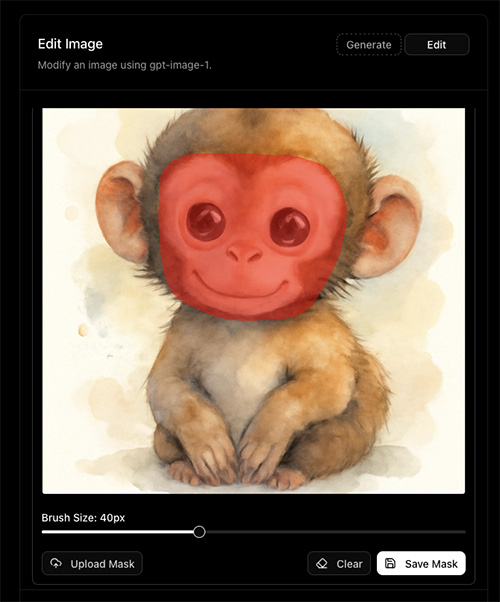
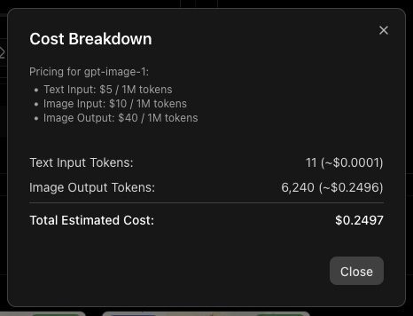

#  GPT-IMAGE-1 Playground

一个基于Web的交互式平台，用于体验OpenAI的`gpt-image-1`模型，支持图像生成、编辑和高级功能。

<p align="center">
  
</p>

## ✨ 核心功能

### 🎨 图像生成模式
* **文本到图像**: 从文本提示词创建全新图像
* **参数控制**: 完全控制图像尺寸、质量、输出格式等参数
* **批量生成**: 支持一次生成多张图像（最多10张）
* **智能优化**: 自动优化提示词以获得最佳效果

### 🖌️ 图像编辑模式
* **智能编辑**: 基于文本提示词修改现有图像
* **蒙版工具**: 集成蒙版创建工具，精确控制编辑区域
* **手绘蒙版**: 直接在图像上绘制蒙版区域
* **批量编辑**: 支持同时编辑多张图像

> ⚠️ **注意**: `gpt-image-1`的蒙版功能目前不能保证100%的控制精度。这是已知的模型限制，OpenAI正在未来的更新中解决这个问题。

<p align="center">
  
</p>

### 📊 历史记录与成本追踪
* **完整历史**: 查看所有图像生成和编辑的详细记录
* **参数记录**: 记录每次请求使用的所有参数
* **成本分析**: 显示每次操作的API令牌使用量和预估成本
* **提示词存档**: 保存完整的提示词历史
* **总成本统计**: 查看历史总API成本
* **记录管理**: 支持删除历史记录

<p align="center">
  
</p>

<p align="center">
  
</p>

### 🚀 高级功能
* **灵活视图**: 支持网格视图和单图查看模式
* **快速编辑**: 一键将生成的图像发送到编辑模式
* **剪贴板支持**: 直接从剪贴板粘贴图像到编辑模式
* **智能存储**: 图像同时保存到本地和云存储平台
* **积分系统**: 集成积分管理系统，支持用户配额控制

## 🏗️ 技术架构

### 前端技术栈
* **Next.js 15**: 基于React的现代Web框架
* **TypeScript**: 类型安全的JavaScript开发
* **Tailwind CSS**: 实用优先的CSS框架
* **Radix UI**: 无样式的可访问组件库
* **Dexie.js**: 浏览器IndexedDB数据库

### 后端服务
* **OpenAI API**: 集成最新的gpt-image-1模型
* **文件存储**: 本地文件系统存储
* **云存储**: 第三方云存储平台集成
* **JWT认证**: 安全的用户认证系统
* **积分管理**: 用户积分和配额管理

### 存储架构
* **双重存储**: 本地文件系统 + 云存储平台
* **自动同步**: 图像自动上传到云存储
* **URL映射**: 智能URL管理和重定向
* **缓存优化**: 浏览器缓存和CDN优化

## 🚀 快速部署

### Vercel一键部署

🚨 **警告**: 从`main`或`master`分支部署时，您的Vercel部署将对任何拥有URL的人公开可用。从其他分支部署需要用户登录Vercel（您的团队）才能访问预览版本。

[](https://vercel.com/new/clone?repository-url=https://github.com/alasano/gpt-image-1-playground&env=OPENAI_API_KEY,APP_PASSWORD&envDescription=OpenAI%20API%20Key%20is%20required.%20Images%20are%20stored%20on%20the%20server%20and%20cloud%20storage.&project-name=gpt-image-playground&repository-name=gpt-image-playground)

部署过程中会提示您输入`OPENAI_API_KEY`和`APP_PASSWORD`。应用程序会自动处理Vercel serverless环境下的图像存储。

### 其他平台部署
* **Netlify**: 支持静态站点部署
* **Railway**: 支持Node.js应用部署
* **Docker**: 提供容器化部署方案
* **自托管**: 支持传统服务器部署

## ⚙️ 环境变量配置

### 必需环境变量

| 变量名 | 说明 | 默认值 |
|--------|------|--------|
| `OPENAI_API_KEY` | OpenAI API密钥 | - |
| `NEXT_PUBLIC_ADMIN_URL` | 后端管理系统地址 | `http://localhost:8000` |

### 可选环境变量

| 变量名 | 说明 | 默认值 |
|--------|------|--------|
| `OPENAI_API_BASE_URL` | 自定义OpenAI兼容API端点 | OpenAI默认端点 |
| `APP_PASSWORD` | 应用访问密码 | - |
| `HTTP_PROXY` / `HTTPS_PROXY` | 代理服务器配置 | - |

## 🛠️ 本地开发

### 系统要求

* **Node.js**: 版本20或更高
* **包管理器**: npm、yarn、pnpm或bun
* **操作系统**: Windows、macOS或Linux

### 安装步骤

#### 1. 克隆项目
```bash
git clone https://github.com/alasano/gpt-image-1-playground.git
cd gpt-image-1-playground
```

#### 2. 安装依赖
```bash
npm install
# 或
yarn install
# 或
pnpm install
# 或
bun install
```

#### 3. 配置环境变量
创建`.env.local`文件并添加必要的环境变量：

```dotenv
# 必需
OPENAI_API_KEY=your_openai_api_key_here
NEXT_PUBLIC_ADMIN_URL=http://localhost:8000

# 可选
APP_PASSWORD=your_app_password
OPENAI_API_BASE_URL=https://your-custom-endpoint.com
```

#### 4. 启动开发服务器
```bash
npm run dev
# 或
yarn dev
# 或
pnpm dev
# 或
bun dev
```

#### 5. 访问应用
在浏览器中打开 [http://localhost:3301](http://localhost:3301)

## 🔧 高级配置

### 自定义API端点
如果您需要使用OpenAI兼容的API端点（如本地模型服务器或其他提供商），可以在`.env.local`文件中指定：

```dotenv
OPENAI_API_KEY=your_openai_api_key_here
OPENAI_API_BASE_URL=https://your-compatible-api-endpoint.com
```

### 密码保护
设置应用访问密码以增加安全性：

```dotenv
APP_PASSWORD=your_secure_password_here
```

设置后，前端会要求输入密码才能访问应用。

### 代理配置
如果需要通过代理访问OpenAI API：

```dotenv
HTTP_PROXY=http://proxy-server:port
HTTPS_PROXY=https://proxy-server:port
```

## 📱 使用指南

### 图像生成
1. 选择"生成"模式
2. 输入详细的图像描述
3. 调整参数（尺寸、质量、格式等）
4. 点击"生成图像"
5. 等待生成完成并查看结果

### 图像编辑
1. 选择"编辑"模式
2. 上传源图像
3. 输入编辑指令
4. 可选：创建或上传蒙版
5. 点击"编辑图像"
6. 查看编辑结果

### 历史管理
* 查看所有操作历史
* 分析成本和使用情况
* 管理历史记录
* 重新使用之前的参数

## 🔒 安全特性

* **API密钥保护**: 密钥仅在后端使用，不会暴露给客户端
* **密码验证**: 可选的访问密码保护
* **JWT认证**: 安全的用户认证系统
* **输入验证**: 严格的输入参数验证
* **错误处理**: 安全的错误信息处理

## 🌟 特色亮点

* **零配置部署**: 开箱即用，无需复杂配置
* **响应式设计**: 支持各种设备和屏幕尺寸
* **暗色主题**: 内置暗色主题支持
* **国际化**: 支持多语言界面
* **性能优化**: 优化的图像加载和缓存
* **可扩展性**: 模块化架构，易于扩展

## 🤝 贡献指南

我们欢迎各种形式的贡献！

### 如何贡献
1. Fork项目
2. 创建功能分支 (`git checkout -b feature/AmazingFeature`)
3. 提交更改 (`git commit -m 'Add some AmazingFeature'`)
4. 推送到分支 (`git push origin feature/AmazingFeature`)
5. 创建Pull Request

### 贡献类型
* 🐛 Bug修复
* ✨ 新功能
* 📚 文档改进
* 🎨 UI/UX改进
* ⚡ 性能优化
* 🔧 配置改进

## 📄 许可证

本项目采用MIT许可证 - 查看 [LICENSE](LICENSE) 文件了解详情。

## 🙏 致谢

* OpenAI提供的强大AI模型
* Next.js团队提供的优秀框架
* 所有贡献者的辛勤工作
* 开源社区的支持

## 📞 支持与反馈

* **问题报告**: [GitHub Issues](https://github.com/alasano/gpt-image-1-playground/issues)
* **功能请求**: [GitHub Discussions](https://github.com/alasano/gpt-image-1-playground/discussions)
* **文档**: [项目Wiki](https://github.com/alasano/gpt-image-1-playground/wiki)

---

<p align="center">
  <strong>⭐ 如果这个项目对您有帮助，请给我们一个星标！</strong>
</p>
# gen-image-1-playground

